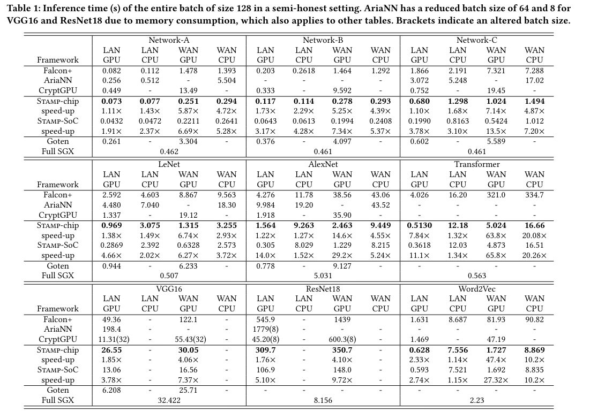

# Artifact Appendix

Paper title: **Efficient Privacy-Preserving Machine Learning with Lightweight Trusted Hardware**

Artifacts HotCRP Id: **#Enter your HotCRP Id here**

Requested Badge: **Reproducible**

## Description

A maliciously secure framework for efficient 3-party trusted hardware aided protocols for neural networks inference. This work builds off [Falcon](https://github.com/snwagh/falcon-public) and other prior works. This frame work does the inter-party communication and CPU computation that happens during the protocol, and generate the LTH bandwidth usage numbers for simulation of LTH overhead. 

### Accessibility
The code is also publicly available in the github repo https://github.com/HuangPZ/STAMP_public.

### Estimated Time and Storage Consumption
Depends on the internet setting the time may vary, but should be withing an hour for all models with a proper GPU support. For CPU, do not run on VGG16 and ResNet18 since they will be not finishing within hours and are not meaningful for the paper's comparison.

32GB of RAM and minimum storage that can contain the environment and the code should be able to host the experiments.

### Repository Structure

* `files/`    - Shared keys, IP addresses and data files.
* `files/preload`    - Contains data for pretrained network from SecureML. The other networks can be generated using `scripts` and functions in `secondary.cpp`
* `lib_eigen/`    - [Eigen library](http://eigen.tuxfamily.org/) for faster matrix multiplication.
* `src/`    - Source code of STAMP.
* `util/` - Dependencies for AES randomness.
* `output/` - Detailed output of runtime and breakdown of overhead.
* `scripts/` - Contains python code to generate trained models for accuracy testing over a batch.


## Basic Requirements
* The code has been developed and tested with [Ubuntu](http://www.ubuntu.com/) 20.04 on x86 machines.

## Environment
* **Basic Required packages for STAMP:**

  g++

  make

  libssl-dev

  libzmq3-dev


  Install these packages with your package manager, e.g, `sudo apt-get install <package-name>`.

  If you want to run with GPU, make sure to install [CUDA](https://docs.nvidia.com/cuda/cuda-installation-guide-linux/).

## Building the code

- The defualt makefile uses CUDA and cudatoolkit/driver is needed for compiling and running. Make sure to check the CUDA location matches your environment. You can change the make file line:
```
USE_CUDA := 1
```
and the global.h
```
#define USE_CUDA true
```
to run CPU only experiments. You can change the makefile SECURITY:= Semi-honest or SECURITY:= Malicious to control the threat model before compiling.


- To build STAMP, run the following commands:

```
make all -j$(nproc)
```


## Testing the framework

- To test on a single terminal, use `make terminal` - runs locally by defualt
- To test on a distributed setup, use `make zero/ make one/ make two` as three process (on three machines potentially). You may change the IP files in ./files/ and the RUN_TYPE in makefile to control the connections.
- You may need to create an `outout\` folder if it does not exist.

You may change the main.cpp if you only want to test on specific networks. 


#### Quick Debugging suggestions
If an "address taken" error occurs after make terminal, please use 
```
pkill STAMP.out
```
to kill all running STAMP program in the background if your previous run did not exit normally.

### Main Results
The results are mainly the execution time compared with [Falcon](https://github.com/snwagh/falcon-public), [AriaNN](https://github.com/LaRiffle/ariann), [Goten](https://github.com/goten-team/Goten), and [CryptGPU](https://github.com/jeffreysijuntan/CryptGPU) that can be conducted individually. The numbers of actual running time may depend on the machine, but the advantage of our scheme should be similar to what is reported in the paper, and the communication amount should match what is reported in the paper too. An example of table from the paper is as follows:



### LTH Hardware and Experiments
The LTH part of the STAMP is tested on Arduino Due which publicly available for purchase in Arduino official sites. The computation overhead is collected by simply performing the estimated amount of operations (which are mainly int32 addition and fewer multiplications). The LTH communication overhead is estimated using the bandwidth usage number generated by this code. The main overhead of the LTH-Chip, which is also demonstrated in figure 4 of the paper, comes from the CPU-LTH communication time.

## License

This project is licensed under the MIT License - see the [LICENSE](LICENSE) file for details.

